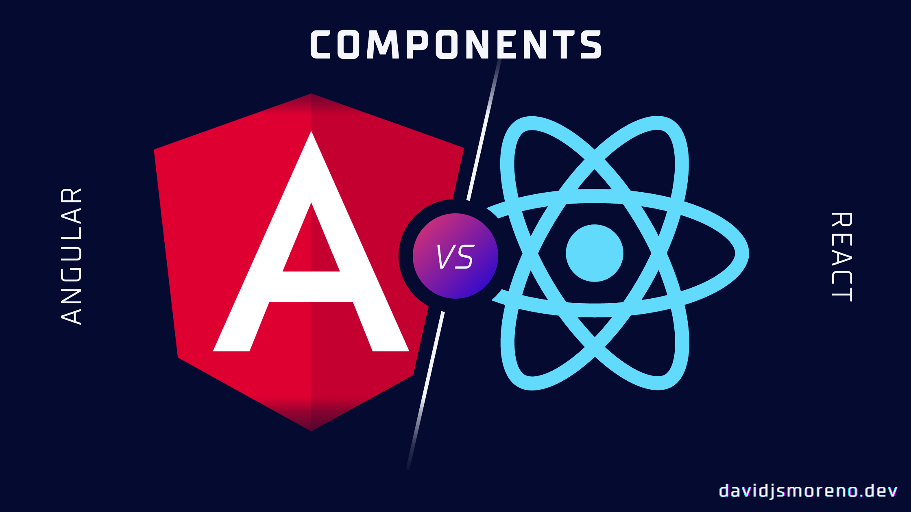

Hello and welcome to the second module of this React Crash Course for Angular Developers, please go to the table of content if you want to check the previous chapters.

[Course Index](/posts/react-crash-course-for-angular-developers-index/)

—



Today you’re going to learn how to create components in React, manage local state, styles, basic component communications, and a couple more things side-by-side of similar code in Angular.


## Angular Templates vs React JSX 



In Angular, a template is a chunk of HTML. Use special syntax within a template to build on many of Angular's features.

[Angular official documentation](https://angular.io/guide/template-syntax)



With **Angular templates**, you **usually** separate your component CSS, HTML, and Logic (Typescript) into different files.

But with JSX you don’t separate your template code (e.g HTML) and logic in separate files, but that does not mean that the code is a mess where there’s no separation of concerns.



The separation of concern occurs on the code side.

[JSX For Angular Developers](https://itnext.io/jsx-for-angular-developers-23f9d1f21259)



Being said that, **[JSX](https://www.telerik.com/blogs/beginners-guide-loops-in-react-jsx#:~:text=JSX%20in%20a%20Nutshell&text=JSX%20is%20a%20custom%20syntax,the%20full%20power%20of%20JavaScript.) is a custom syntax extension to JavaScript** which is used for creating markup with React. 

It might remind you a bit of a templating language, but with JSX you can use the full power of JavaScript, let’s take a look at this component with and without JSX.

**Using JSX**

```react
class Hello extends React.Component {

  render() {

    return <div>Hello {this.props.toWhat}</div>;

  }

}

const root = ReactDOM.createRoot(document.getElementById('root'));

root.render(<Hello toWhat="World" />);
```

**Without JSX,** after processing the [JSX with Babel or Typescript](https://reactjs.org/docs/react-without-jsx.html)

```react
class Hello extends React.Component {

  render() {

    return React.createElement('div', null, `Hello ${this.props.toWhat}`);

  }

}

const root = ReactDOM.createRoot(document.getElementById('root'));

root.render(React.createElement(Hello, {toWhat: 'World'}, null));
```


## The basics of component creation

Let’s create the classic hello world:


### React Class components

```react
import * as React from 'react';

export class Hello extends React.Component {

  render() {

    return <div>Hello world class based component</div>;

  }

}
```


### React Functional components

```react
import * as React from 'react';

export const Hello = () => {

  return <div>Hello functional component</div>;

};
```

Complete code examples: [class](https://stackblitz.com/edit/react-ts-xxdvdd?file=components%2FHelloWorldClass.tsx) and [functional](https://stackblitz.com/edit/react-ts-xxdvdd?file=components%2FHelloWorldFunction.tsx).


### Equivalent code in Angular

```typescript
import { Component, Input } from '@angular/core';

@Component({

  selector: 'hello',

  template: `<h1>Hello</h1>`,

})

export class HelloComponent {

  @Input() name: string;

}
```

[Complete code example.](https://stackblitz.com/edit/angular-ivy-cehmyd?file=src%2Fapp%2Fcomponents%2Fhello.component.ts)

In Angular ([prior v14](https://angular.io/guide/standalone-components)) where we need to add the component to [the module’s declaration array](https://stackblitz.com/edit/angular-ivy-cehmyd?file=src%2Fapp%2Fapp.module.ts) before being able to use it,

In React we need to make our component descendant of the [root component.](https://stackblitz.com/edit/react-ts-xxdvdd?file=index.tsx)

```react
import * as React from 'react';
import { StrictMode } from 'react';
import { createRoot } from 'react-dom/client';
import App from './App';

const rootElement = document.getElementById('root');

const root = createRoot(rootElement);

root.render(

  <StrictMode>

    <App />

  </StrictMode>

);

```


## Event handling and Component State

Let’s create a mini-todo list component to illustrate the differences.

### React Class components




### React Functional Components + Hooks



Complete code example: [class](https://stackblitz.com/edit/react-ts-xxdvdd?file=components%2FTodoListClass.tsx) and [functional](https://stackblitz.com/edit/react-ts-xxdvdd?file=components%2FTodoListFunction.tsx).


### Equivalent code in Angular



[Full code example](https://stackblitz.com/edit/angular-ivy-cehmyd?file=src%2Fapp%2Fcomponents%2Ftodo-list.component.ts).


## Lifecycles

As we mentioned before, this is a turbo-crash course, so I’d recommend taking a look at this [reference for the lifecycle hooks](https://medium.com/codex/the-lifecycle-of-a-react-component-8e01332a068d).


### React Class components




### React Functional Components + Hooks



Complete code example: [class](https://stackblitz.com/edit/react-ts-xxdvdd?file=components%2FLifecycles.tsx) and [functional](https://stackblitz.com/edit/react-ts-xxdvdd?file=components%2FLifecyclesFunction.tsx).


### Equivalent code in Angular



[Complete code example](https://stackblitz.com/edit/angular-ivy-cehmyd?file=src%2Fapp%2Fcomponents%2Flifecycles.component.ts)


## Component styles

Let’s take a pause here, I’d like to think that there are as many ways to style a component in React as stars in the sky, of course, that was an exaggeration but the truth is: [there are A LOT of ways to style a component in React.](https://www.geeksforgeeks.org/8-ways-to-style-react-components/)

This course is going to stick to the _Plain Old CSS_, down the road we’re going to revisit this topic with an overview of the most popular styling methods in React.

```css
.foo {
    color: red;
}
```

```javascript

// foo.tsx

import ‘./styles.css’
```


## Pipes



Pipes are simple functions to use in template expressions to accept an input value and return a transformed value



JSX is javascript under the hood so everything enclosed in curly braces is considered a valid expression, so there’s no need for a built-in pipe mechanism, for example, the [uppercase](https://angular.io/api/common/UpperCasePipe). pipe in Angular.

```react
{{word || uppercase}}
```

In React we could do the following:

```javascript
const uppercase = (word)  {

  return word.toUpperCase();

}

{uppercase(word)}
```

Let’s recreate some of the [built-in pipes](https://www.angularjswiki.com/pipes/list/) using a couple of libraries like [@stdlib/string-base](https://github.com/stdlib-js/string-base) and the radash [chain](https://radash-docs.vercel.app/docs/curry-chain) method.

```react
import * as React from 'react';
import * as stringBase from '@stdlib/string-base';
import { chain } from 'radash';

const { pascalcase: titleCase, uppercase } = stringBase;

export const Pipes = () => {

  const string = 'Hello world';

  const snakeString = 'snake_case_string';

  return (

    <React.Fragment>

      <p>{chain(titleCase)(string)}</p>

      <p>{chain(titleCase, uppercase)(snakeString)}</p>

    </React.Fragment>

  );

};
```

If you feel adventurous you could use [the Pipe Operator (|>)](https://github.com/tc39/proposal-pipeline-operator) instead of the radash chain function but not recommended for production apps yet (it’s still a proposal, not a standard yet).

```javascript
snakeString |>

titleCase |>

uppercase;
```

The opinionated nature of Angular shines in when we talk about Pipes, it provides a lot by default, in the last chapter of this course we will recommend equivalent libraries to do the same with React.

[Complete code example](https://stackblitz.com/edit/react-ts-xxdvdd?file=components%2FPipesExample.tsx)


## Directives



Directives are classes that add new behavior or modify the existing behavior to the elements in the template.



It is the same story as pipes, let’s recreate the built-in directives using React expressions.



[Complete code example](https://stackblitz.com/edit/react-ts-xxdvdd?file=components%2FDirectivesFunction.tsx).

To create custom behavior we should rely on components or hooks, but that’s a topic that will be covered in upcoming chapters.


## Basic component Communication


### Pass data from parent to child.

It’s pretty straightforward, in Angular we use the Input decorator, in React we use [props](https://reactjs.org/docs/components-and-props.html#:~:text=When%20React%20sees%20an%20element,call%20this%20object%20%E2%80%9Cprops%E2%80%9D.).


#### React

```react
import * as React from 'react';

export type Hero = {

  name: string;

};

export type Props = {

  hero: Hero;

  leader: string;

};

export const ParentToChild = (props: Props) => {

  return (

    <React.Fragment>

      <h3>{props.hero.name} says:</h3>

      <p>

        I, {props.hero.name}, am at your service, {props.leader}.

      </p>

    </React.Fragment>

  );

};
```

[Complete code example](https://stackblitz.com/edit/react-ts-xxdvdd?file=components%2FParentToChild.tsx).


#### Equivalent code in Angular

```typescript
import { Component, Input } from '@angular/core';

export interface Hero {

  name: string;

}

@Component({

  selector: 'app-parent-to-child-hero',

  template: `

    <h3>{{hero.name}} says:</h3>

    <p>I, {{hero.name}}, am at your service, {{leaderName}}.</p>

  `,

})

export class ParentToChildHeroComponent {

  @Input() hero!: Hero;

  @Input('leader') leaderName = '';

}
```

[Complete code example](https://stackblitz.com/edit/angular-ivy-cehmyd?file=src%2Fapp%2Fcomponents%2Fparent-to-child-hero.component.ts).


### Pass data from child to parent.

Like the previous one, Angular uses the Output decorator and React and callback function passed through props. Still, conceptually it’s almost the same:

**A function call will be executed by the child component where we can send data to the parent component.**


#### React



[Complete code example](https://stackblitz.com/edit/react-ts-xxdvdd?file=components%2FChildToParent.tsx,components%2FParent.tsx)


#### Equivalent code in Angular



[Complete code example](https://stackblitz.com/edit/angular-ivy-cehmyd?file=src%2Fapp%2Fcomponents%2Fchild-to-parent.component.ts,src%2Fapp%2Fcomponents%2Fparent.component.ts)


## Next Chapter: Routing in React vs Angular (very soon)

From here and the rest of the course we’re going to use functional components and hooks as the standard way of creating components in React.

In the next module, we’re going to talk about Routing. **[Please subscribe to my newsletter if you want to get notified when this new chapter gets released.](https://davidjsmoreno.dev/)**


## Learn more


* [Angular Component interaction](https://angular.io/guide/component-interaction)
* [React Component Interaction](https://www.pluralsight.com/guides/react-communicating-between-components)
* [Naming conventions in React](https://stackoverflow.com/questions/43973199/file-naming-conventions-in-reactjs)
* [Change Detection React](https://indepth.dev/posts/1064/what-every-front-end-developer-should-know-about-change-detection-in-angular-and-react)
* [Functional vs Class-based components in React](https://www.twilio.com/blog/react-choose-functional-components)
* [Fragments](https://reactjs.org/docs/fragments.html)
* [Angular directives in React](https://lukaonik.medium.com/angular-directive-alternative-in-react-8777881536da)
* [Angular Pipes in React](https://stackoverflow.com/questions/54668921/how-we-can-use-pipes-in-react-javascript)
* [React class-based lifecycle with hooks](https://stackoverflow.com/questions/53945763/componentdidmount-equivalent-on-a-react-function-hooks-component)