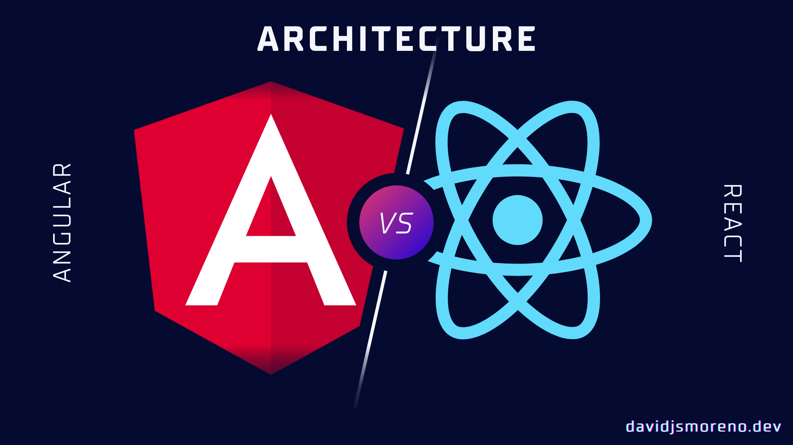

[Course Index](/posts/react-crash-course-for-angular-developers-index/)
---



A **JavaScript** [library](http://freecodecamp.org/news/is-react-a-library-or-a-framework/) for building user interfaces, _reactjs.org._



")

One of the main differences between React and Angular is that with the latter you get a lot of out-the-box: a Router, HTTP request client, Pipes, Directives, etc.

But React main responsibility is to allow you to build and render your IU components, and it does that using a [data structure](https://www.geeksforgeeks.org/data-structures/#:~:text=A%20data%20structure%20is%20a,%2C%20retrieving%2C%20and%20storing%20data.) called virtual DOM and reconciliation algorithm.

## How does React work?

### Virtual DOM and the reconciliation algorithm

Virtual DOM is a data structure built to mimic the real DOM with one difference:



A virtual DOM object has the same properties as a real DOM object, but it lacks the real thing's power to directly change what's on the screen, [Codecademy](https://www.codecademy.com/article/react-virtual-dom)_._



The thing is that operations to update the real [DOM](https://developer.mozilla.org/en-US/docs/Web/API/Document_Object_Model/Introduction) are generally expensive in memory.

When you update the component [state](https://en.wikipedia.org/wiki/State_(computer_science)) in React these changes are applied to the virtual DOM, then it’s time for the reconciliation algorithm (or diffing algorithm) to compare the changes between the virtual DOM and the Real DOM.

**Finally, it will apply and update the changes only to those objects and only those objects in the Real DOM.**

**if you’re familiar with Git, you could think of DOM as your main branch, Virtual DOM as your Develop branch, and the reconciliation algorithm as your Pull Request,** it’s not exactly the same but it’s a mental model that makes it easier to understand the concept.

")



React can update only the necessary parts of the DOM. React’s reputation for performance comes largely from this innovation, [Codecademy](https://www.codecademy.com/article/react-virtual-dom).



Also, this abstracts out the attribute manipulation, event handling, and manual DOM updating that you would otherwise have to use to build your app according.

## Next Chapter: [Components in React vs Angular](/posts/react-crash-course-for-angular-developers-components)

For now, this is enough of React’s architecture, later in the course, we’re going to revisit it expanding it with more stuff like React Fiber and other interesting things.

In the next chapter, we’re going to check the side-by-side differences between React and Angular components: the basics, local state management, component life cycles, and basic styling.

If would like to know when the next chapter in this course gets released, please subscribe to my newsletter at the end of this page.

## Learn more

* [Virtual DOM and Internals](https://reactjs.org/docs/faq-internals.html)
* [React: The Virtual DOM](https://www.codecademy.com/article/react-virtual-dom)
* [React Fiber Architecture](https://github.com/acdlite/react-fiber-architecture)
* [Is React a Library or a Framework? Here's Why it Matters](https://www.freecodecamp.org/news/is-react-a-library-or-a-framework/)
* [What Is React? Everything a Tech Leader Needs to Know](https://brainhub.eu/library/what-is-react)
* [The Good and the Bad of ReactJS and React Native](https://www.altexsoft.com/blog/engineering/the-good-and-the-bad-of-reactjs-and-react-native/)
* [Client-side architecture](https://twitter.com/apollographql/status/1255907988210057217/photo/1)

---

**Please, subscribe to our newsletter to get our amazing content!** 
 
<iframe src="https://embeds.beehiiv.com/a73a7bea-7c89-48e9-bf8d-65554157c3d4?slim=true" data-test-id="beehiiv-embed" frameborder="0" scrolling="no" style="margin: 0; border-radius: 0px !important; background-color: transparent;" width="100%"></iframe>