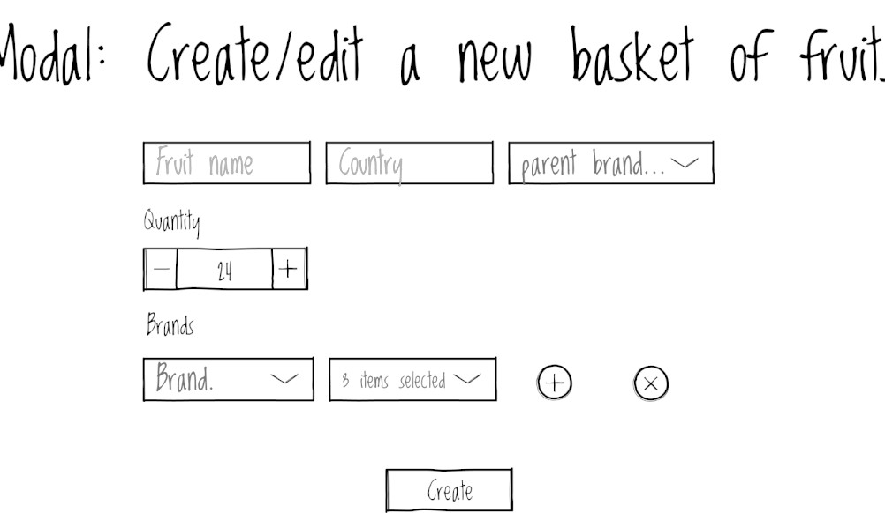
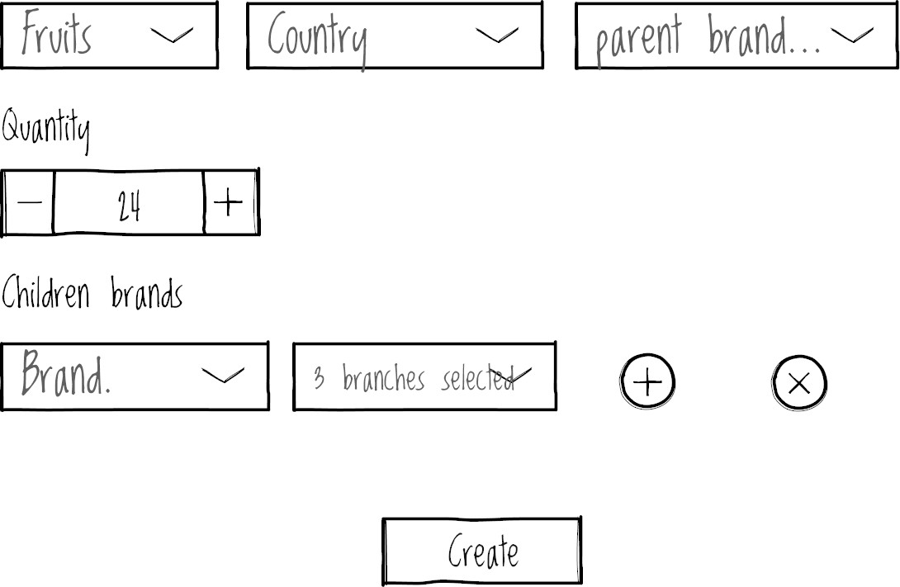

Let’s face it: [Scrum](https://www.atlassian.com/agile/scrum) it’s not perfect and while a lot of teams do their best to follow the methodology the best way possible the truth is that the real world is wild and sometimes you need to make compromises to deliver value and meet the business needs.

## Problem

Part of this imperfection is the way the user [stories are written](https://www.romanpichler.com/blog/10-tips-writing-good-user-stories/amp/), one day I was given a story comprised just of a UI design and a title.

Somehow this story managed to escape from refinement and planning sessions and was not [ready to be done](https://www.scruminc.com/definition-of-ready/), for me the story lacks [key aspects](https://frontend.turing.edu/lessons/module-3/user-stories.html) an ideal good Frontend User Story should have:

* Descriptive title, check.
* Final UI Design, check.
* Clear and defined scope through [acceptance criteria](https://www.mobindustry.net/blog/how-to-write-acceptance-criteria-examples-and-best-practices/), fail.
* Unknown check: Dependencies, feasibility, follow-up tickets that should be created? etc, fail.

## The ideal user story structure

In the real world sometimes we can’t return things to the backlog if they are not ready, deadlines need to be met and a story like this needs to be “refined along the way”, let’s analyze this story and refine it the most possible.

### The questions

**Fruit name**

What are the character limits for the fruit name? instead of a text box, should not be a selection box showing all the fruits offered by the business?

**Country**

Why the country is not a selection box?

**Parent brand**

Where do the values for the parent brand come from? should be hardcoded?, or come from an API service? does this service exist?

**Quantity**

What’s the minimum and maximum quantity of fruits to be added to the basket? is this quantity the same for all the fruits offered by the business?

**(Possibly child) brand.**

Where do the values for a brand come from? Do the brands are related to the parent brand? what kind of cross-validation between parent and child brand exists?

What the hell is “items” in the items selection box? what’s the maximum or minimum of brands to be added?

And finally, **the create button,** does the service for creating a basket exist? also, the ticket says create and edit, does this service handle the edit functionality too?

### The answers

We met with our Product owner, the designer, and the backend developer, after that we also got intel from real users and we brought clarity to the previous questions, leaving us with a beautifully crafted user story.

**Ticket name:** Create a new basket of fruits modal

**Design:**

**Acceptance criteria**

**List screen**

As a user, I’d like to create a new basket of fruit from the Basket fruit List Screen.

Add a new basket button should show the Create a new basket of fruits modal.

**Fruits**

Fruits selection is a required field and its values come from Fruits service.

The country is a required field, we should reuse the existing Country Component.

**Quantity**

Quantity is a required field and is an integer between 1 and 10.

**Brands**

Parent brand selection is a required field and its values come from Brands service.

Children's brand's selection and branches are required fields and its values come from Brands service.

I’d like to select a parent brand before being able to add or modify children's brands, at least one child brand with a branch should be selected.

If I select a new parent branch the children's branch should be rebooted to its initial state.

**Create**

The previous validation should be met so I can create a correct basket of fruit.

**Loading and Error states**

Loading and error handling should use the same pattern used throughout the application.

**Dependencies**

**Covered**

Loading and error state mechanism, ticket link.

Basket fruit List Screen, ticket link.

Get Fruits service, service swagger documentation.

Get Brands service, service swagger documentation (for both parent and children brands).

**Existing**

Create Fruit Basket API Service Ticket -  To do but API contract defined, mock API used in the meantime.

Update Fruit Basket API Service Ticket -  To do but API contract defined, mock API used in the meantime.

**Follow up tickets**

Edit a new basket of fruits modal - To Do

Connect to the real API ticket for both Edit and Create flows - To do

**Story points**: 3

A note about Acceptance criteria, some people prefer to use BDD to write clear acceptance criteria, I usually prefer that too but in this article, for sake of brevity we did not use the given-then-when formula but I encourage you to take a look at [this link](https://revelry.co/insights/development/behavior-driven-development-bdd/) if you’re not familiar with it.

## Give a hand to the Product Owner

A solution to this problem could be as Developers, pre-refine the stories: ask your Product Owner what will be the priority for the next sprint and take one hour per day and check the backlog, review the tickets and collect a list of the questions to bring to the next refinement, that way we decrease the risk of very thin or unclear stories reaching the sprint plus your knowledge about the business will increase over the time, which is always valuable.

## Conclusion

The way that we wrote the user story here is not intended to be the only one or the perfect one with no flak, actually, we surely leave some unknows to be answered that might be discovered once the ticket is started and require small adjustments down the road, but hey: that’s the magic of agile, or not? adapt to the change! 🙈.

Also, some people would argue that we should not be [dividing](https://www.mountaingoatsoftware.com/blog/video-training-how-to-split-user-stories#comments) a story between a backend or frontend, or backend or mobile, and we should avoid the [silos approach](https://pm.stackexchange.com/a/26421), and I tend to agree with this but sometimes this is how things work in some organizations and sometimes we should adapt to the current flow before trying to change it or improve it progressively, this is a story for another article.

The thing is that the structure given in this article serves as a starting point, The real takeaway behind this article is no matter what User Story structure you use the most important thing is: **to use one that allows you to understand the requirement, we must not create software in the darkness assuming a lot of stuff, ask, refine, iterate.**

Happy coding!

Writing Effective User Stories